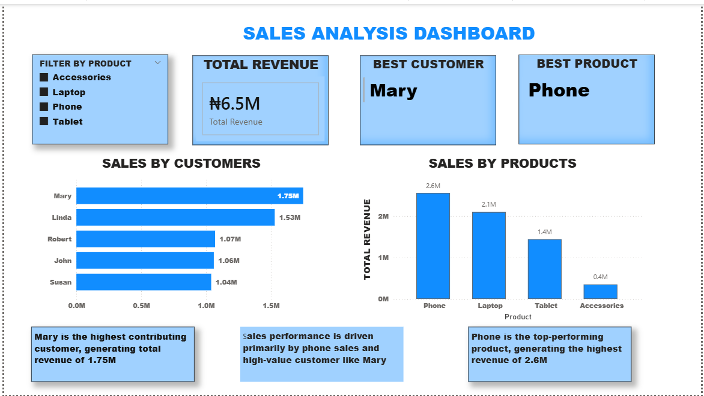

 Sales Analysis Dashboard (Power BI)

## Overview
This project presents a Sales Analysis Dashboard built using Power BI. It provides insights into revenue performance, top customers, and best-selling products.

## Key Insights
- Total Revenue: ₦6.5M
- Best Customer: Mary (₦1.75M)
- Best Product: Phone (₦2.6M)

## Features
- Sales by Customers (Bar Chart)
- Sales by Products (Column Chart)
- Interactive Product Filter
- KPI Cards for quick insights

## Tools Used
- Power BI
- Data Visualization

## Dashboard Preview

## File
- `sales-analysis-dashboard.pbix` → Power BI file

## Author
Eze Chinweotito
